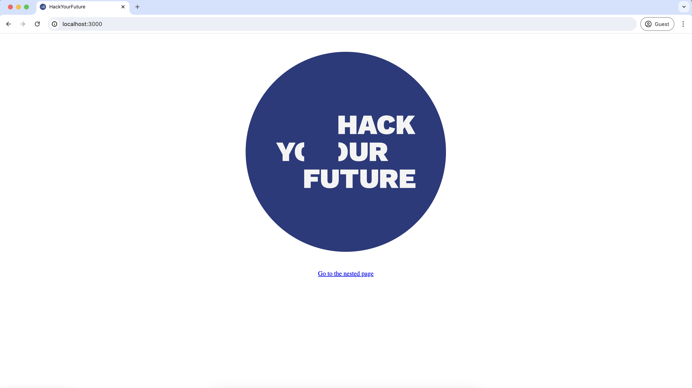
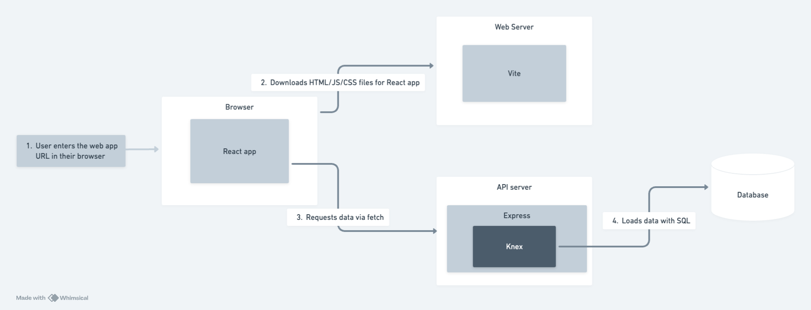

# MovieAPP


It consists of two main packages:

- `api` which is a NodeJS project using Express for the API
- `app` which is Next project using React for the web app


## Prerequisites

We used PostgreSQL for the database.

## Getting started

> Before you start, make sure no other projects are running, in order to have the ports free.

To get started you'll need terminals.

In the  terminal run the following commands:

```
cd api
cp .env-example .env
npm install
npm run dev
```


You can then open the web app at [http://localhost:3000](http://localhost:3000).



 


                                    
   


          

     
   


## Architecture diagram



## Applying consistent formatting

Before you commit any changes you've made, you can run the command `npm run format` in either package to format the code using [Prettier](https://prettier.io/).

Using a consistent code style makes it easier to read code which improves productivity and avoid bugs.  
When collaborating with other people, a code base should still look like it was written by a single person.

## Checking for common code problems

Before you commit your changes, you can use `npm run check` in either package to check for code issues using [ESLint](https://eslint.org/).

ESLint is a "linter", a tool that scans your code for common code problems, this can help you avoid bugs and write better code.

## Deploying

All 3 components (database, API, web app) can be deployed for free at [Render.com](https://render.com).
Sign in using your Github account to make the process smoother.
When you sign in you can specify which of your repositories you want Render.com to have access to.

[Database and API deployment instructions](./api/README.md#deploying)  
[App deployment instructions](./app/README.md#deploying-a-static-web-app)
